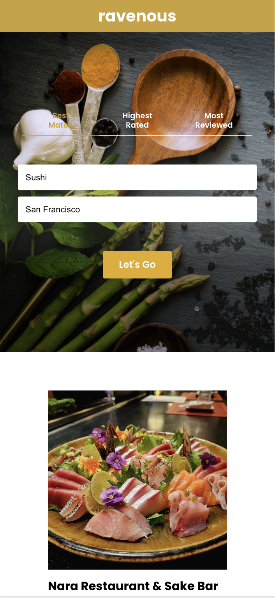

# Ravenous

Yelp-like clone for looking up businesses.

## Features

- **Built with React**: A responsive front-end app for searching businesses via the Yelp API
- **Customizable search results**: Filter by best match, highest rated, or most reviewed
- **Responsive design**: Adapts smoothly to different screen sizes for optimal user experience

## Product

- **Live project link**: https://cyouh95.github.io/ravenous
- **Tech stack**: React, JavaScript, CSS, Yelp API, GitHub Pages

  
  

